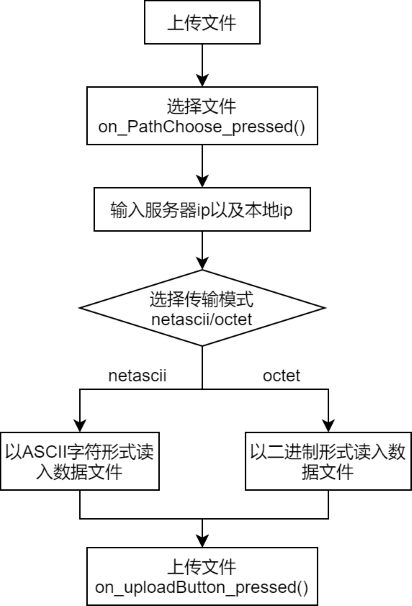

# TFTP客户端

> 一个简易的TFTP客户端:hankey:

### 主要工作流程

### 功能简要说明

* 严格遵守TFTP协议，能与TFTP服务器通信（可以使用Tftpd64软件）
* 上传/下载文件
* 支持两种传输模式netascii/octet
* 记录日志（日志文件保存在tftp.log文件下）
* 提供了两种版本（CLI版本和GUI版本，两个版本核心代码完全相同:smirk: ）

### GUI版本:+1:

> 使用Qt画的图形界面，把代码, pro, ui文件拉进去就能跑 :smiley:

[点我](https://github.com/AgentGuo/TFTP_client/tree/main/gui_client)

图形界面如下：

### CLI版本:-1:

[点我](https://github.com/AgentGuo/TFTP_client/tree/main/client)

界面如下：

